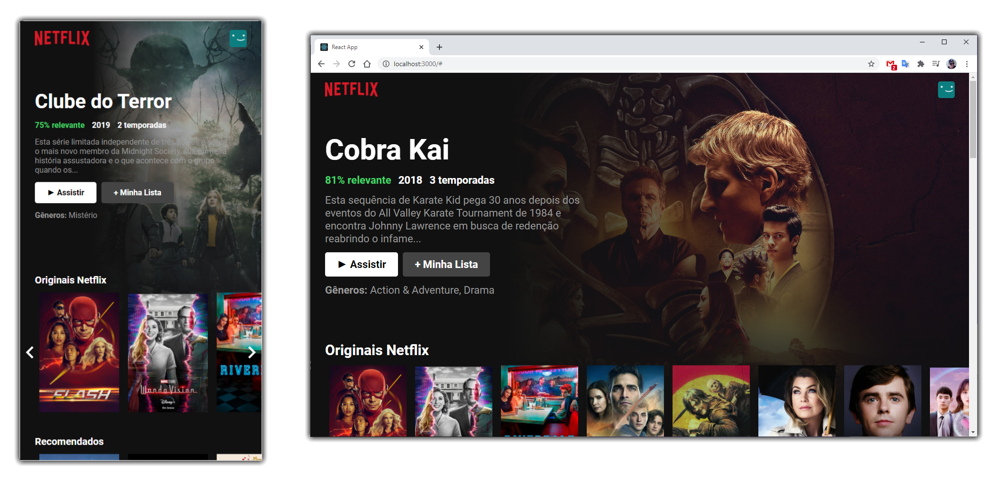

# netflix-clone

Clone do Netflix construído emm ReactJS

## Netflix com ReactJS

## 🚀 Projeto

Este é um pequeno projeto onde foi clonada a interface principal da Netflix utilizando **ReactJS** e consumindo a API tmdb.

A interface contém além da responsividade, animações ao navegar entre os filmes listados em suas categorias.

Todas as informações dos filmes, bem como as imagens e disposição de cada um em sua respectiva categria, foram retiradas da API fornecida do site [themoviesdb.org](www.themoviesdb.org)

## 📦 Dependências extras

- @material-ui/core
- @material-ui/icons

## 📝 Instruções

1. Faça um clone desse repositório `git clone git@github.com:gustavolarsen/netflix-clone.git`
2. Abra o projeto no seu VSCode.
3. No terminal execute `yarn` para instalar todas as dependencias do projeto.4.
4. No terminal execute `yarn star` para iniciar o servidor.

Para que seja possivel acessar as informações da API ao executar a aplicação, você precisará criar uma conta de desenvolvedor no site [themoviesdb.org](www.themoviesdb.org) para receber uma `API_KEY`.

No arquivo `Tmdb.js`, subsitua o valor da api_key na linha 1 `const API_KEY = 'api_key=Sua_Api_Key_Aqui';` com o valor da sua chave gerada pelo site.

## 📄 Licença

Este projeto está sob a licença MIT - acesse [LICENSE](./LICENSE) para mais detalhes.

## 🧑🏻 Autor

Criado com 💙 por Gustavo Larsen
